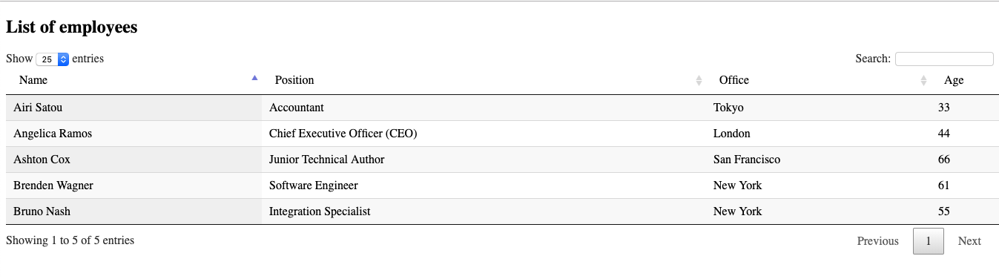

Alita is a agent app for linux, base on go-application-starter-kit.

## Goal

1. monitoring of processes, CPU, memory and hard drive utilization on a Linux server.

2. Remote execution of commands.

## How to Contribute

1. Fork it

2. Create your feature branch (git checkout -b my-new-feature)

3. Commit your changes (git commit -am 'Add some feature')

4. Push to the branch (git push origin my-new-feature)

5. Create new Pull Request

## go-application-starter-kit

    https://github.com/jun283/go-application-starter-kit

My English is terrible, so documentation or correcting comments are also welcome.

## Simple

    /simple

    

## APIs

1.Root

    GET /

2.Log view

    GET /log

3.Host info

    GET /host/info

4.Change host name

    PUT /host/name

    form-data:
    key:hostname  value=<new_host_name>

5.
